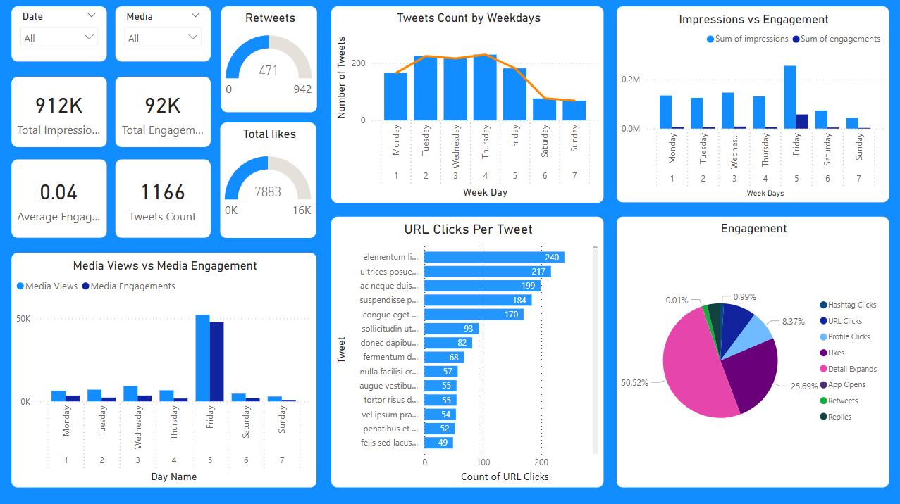
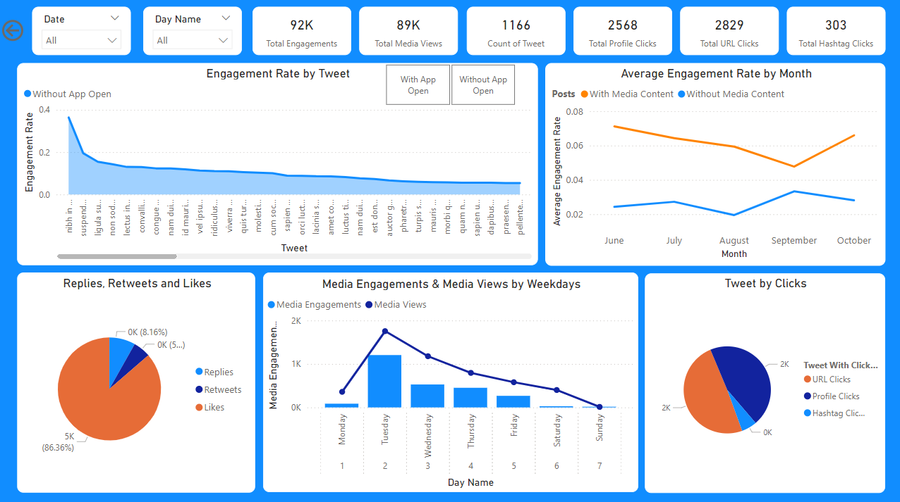

# Twitter Engagement Analysis Power BI Project

This repository contains a Power BI project that analyzes Twitter engagement metrics. The project involves data cleaning, analysis, and visualization of tweets to uncover trends and insights. The analysis is organized into two main dashboards: Internship Tasks and Training Tasks.

## Contents

- `Tweet.xlsx`: The dataset used for analysis.
- `Twitter_Engagement_Analysis.pbix`: The Power BI report file.
- `Twitter_Engagement_Analysis.pbit`: The Power BI template file.
- `Report.pdf`: A detailed report on the analysis and findings.

## Project Overview

### Data Cleaning
The initial dataset was cleaned to ensure accuracy and consistency. This involved handling missing values, correcting data types, and filtering irrelevant data.

### Dashboards

#### Training Tasks
This dashboard includes additional visualizations and information created during training sessions, aimed at enhancing data analysis skills.

- **Demographic Analysis**: Visualizes the demographic breakdown of tweet engagement, including age, gender, and location.
- **Sentiment Analysis**: Analyzes the sentiment of tweets (positive, negative, neutral) and their correlation with engagement metrics.
- **Hashtag Performance**: Evaluates the performance of different hashtags in terms of engagement, reach, and impressions.
- **Time Series Analysis**: Shows the impact of posting times on tweet engagement, helping identify optimal posting times.



#### Internship Tasks
This dashboard focuses on specific tasks assigned during the internship, analyzing various aspects of tweet engagement.

1. **Engagement Rate Trend**
    - **Line Chart**: Displays the trend of the average engagement rate over each month of the year.
    - **Comparison**: Separates the lines for tweets with media content and those without.
    - **Visualization**: Compares the number of replies, retweets, and likes for tweets with media engagements greater than the median value, filtered for tweets posted in the last six months.

2. **Engagement Rate with App Opens**
    - **Comparison**: Shows the engagement rate for tweets with app opens versus tweets without app opens.
    - **Filter**: Includes only tweets posted between 9 AM and 5 PM on weekdays.

3. **Media Interactions**
    - **Dual-Axis Chart**: Displays the number of media views and media engagements by the day of the week for the last quarter.
    - **Highlighting**: Identifies days with significant spikes in media interactions.

4. **Click Proportion**
    - **Pie Chart**: Represents the proportion of total clicks (URL clicks, user profile clicks, and hashtag clicks) for tweets with more than 500 impressions.
    - **Drill-Down**: Allows viewing the specific types of clicks for each tweet.



## Getting Started

### Prerequisites
- [Power BI Desktop](https://powerbi.microsoft.com/desktop/)

### Usage

1. **Clone the repository**:
    ```bash
    git clone https://github.com/yourusername/twitter-engagement-analysis.git
    ```

2. **Open the Power BI file**:
   - Open `Twitter_Engagement_Analysis.pbix` with Power BI Desktop.

3. **Explore the Dashboards**:
   - Navigate through the "Internship Tasks" and "Training Tasks" dashboards to explore the insights derived from the data.

## Report

A detailed report (`Report.pdf`) is included in the repository, providing an in-depth explanation of the data cleaning process, analysis, and key findings.

## License

This project is licensed under the MIT License - see the [LICENSE](LICENSE) file for details.

## Contact

For any inquiries, please contact [work.noah14@gmail.com](mailto:work.noah14@gmail.com).

---

### Acknowledgements
- The data used in this project was sourced from Kaggle.
- Special thanks to the Power BI community for their resources and support.
